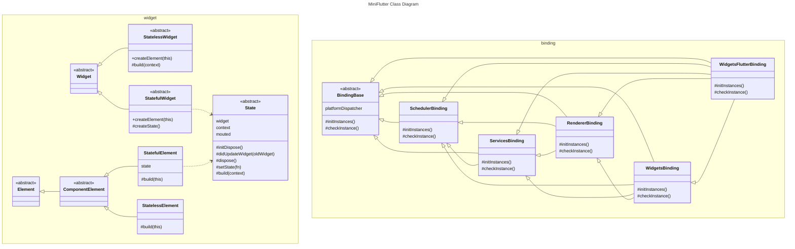

# Miniflutter Class Diagram

## Rules
Arrow type | Description
--- | ---
<\|-- | Inheritance
..> | Dependency

Member visibility | Description
--- | ---
\+ | Public
\- | Private
\# | Protected

## Diagram
