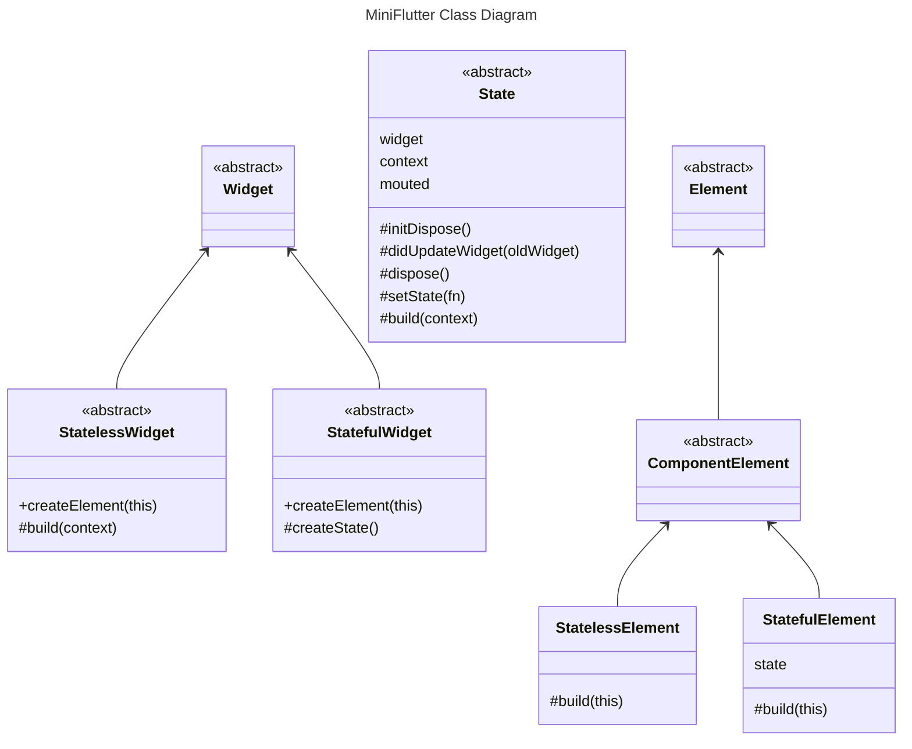

```mermaid
---
title: MiniFlutter Class Diagram
---
classDiagram
    class Widget {
        <<abstract>>    
    }
    class StatelessWidget{
        <<abstract>>    
        +createElement(this)
        #build(context)
    }
    class StatefulWidget {
        <<abstract>>    
        +createElement(this)
        #createState()
    }
    class State {
        <<abstract>>
        widget
        context
        mouted
        #initDispose()
        #didUpdateWidget(oldWidget)
        #dispose()
        #setState(fn)
        #build(context)
    }

    Widget <-- StatelessWidget
    Widget <-- StatefulWidget

    class Element {
        <<abstract>>    
    }
    class ComponentElement {
        <<abstract>>
    }
    class StatelessElement {
        #build(this)
    }
    class StatefulElement {
        state
        #build(this)    
    }

    Element <-- ComponentElement
    ComponentElement <-- StatelessElement
    ComponentElement <-- StatefulElement
```